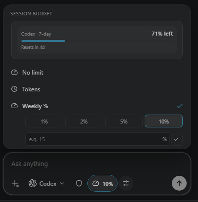

# Perpetual for VS Code

Keep coding when your AI agent hits a limit.

Perpetual is a VS Code workbench for Claude Code and Codex that keeps tasks
moving across providers, limit resets, and optional cloud execution. Your
transcript, repository context, approvals, and worktree stay attached to the
same task instead of getting lost in a new chat or a copied prompt.

## Why install Perpetual?

### Switch providers when limits hit

When Claude Code or Codex reaches a usage limit, Perpetual can pause the active
run and continue the same task on the other ready provider. The task keeps its
context, repository state, queued turns, and transcript.

### Resume automatically when access returns

If neither provider is ready, Perpetual can wait for the relevant limit reset
and resume the task automatically. When the original provider recovers, it can
switch back according to your settings.

### Continue work in the cloud

When local execution cannot continue, optional Cloud Continuity can hand an
eligible task to Claude Code on the web or Codex Cloud. Perpetual can carry work
over during sleep or shutdown, monitor the cloud run, and bring the result back
into the local managed worktree for review.

### Keep transitions reviewable

Every task has durable transcripts, checkpoints, managed worktrees, diffs, and
approval state. Changes return as a reviewable local result instead of silently
replacing your checkout.

### Coordinate agents across your computers

Connect desktop, laptop, and other Perpetual installations with a short-lived
encrypted LAN invite, even when they use different Claude Code or Codex
accounts. Pick a device and agent from the composer, then see the exact handoff
prompt, live progress, follow-ups, and approval requests in one workbench.

Remote agents work in isolated worktrees. Repository writer leases prevent
accidental overlap, and returned patches wait for host-side apply, reject, or
conflict review. An explicit overwrite keeps a recovery backup. The coordination
layer uses bounded state and no extra model calls, so it does not consume
provider usage by itself.

### Budget each task or session

Set a budget for every task from the composer gauge. Choose no limit, a token
target, or a percentage of your provider's weekly limit. Perpetual counts
follow-up turns, wraps up near the target, and pauses cleanly instead of
draining your quota.

## More than a provider switcher

- One workbench for Claude Code and Codex.
- Persistent sessions with queued follow-up turns and resumable history.
- Isolated Git worktrees for safer repository-aware agent runs.
- Read-only, workspace-write, autonomous, and Codex approval modes.
- Local model fallback through Ollama or LM Studio.
- Optional Docker Sandbox execution for Codex.
- GitHub repository sign-in, selection, cloning, diffs, and change review.
- Encrypted multi-device execution with shared prompts, progress, approvals,
  repository locks, and returned-change review.

## Get started

Install Perpetual from the Marketplace, then open the Perpetual view in VS
Code. Install and authenticate at least one supported provider:

- [Claude Code](https://docs.anthropic.com/en/docs/claude-code/overview)
- [Codex](https://github.com/openai/codex)

To use provider switching, install and authenticate both. Cloud Continuity,
Docker Sandbox, GitHub repositories, and local models require their respective
accounts or local services.

Perpetual is designed for trusted workspaces. Review the permission and cloud
handoff settings before enabling autonomous or remote execution.

## Learn more

See the [full documentation and development guide](https://github.com/SakethSripada/Perpetual/blob/main/README.md), or visit the
[security policy](https://github.com/SakethSripada/Perpetual/blob/main/SECURITY.md)
and [support guide](https://github.com/SakethSripada/Perpetual/blob/main/SUPPORT.md).
