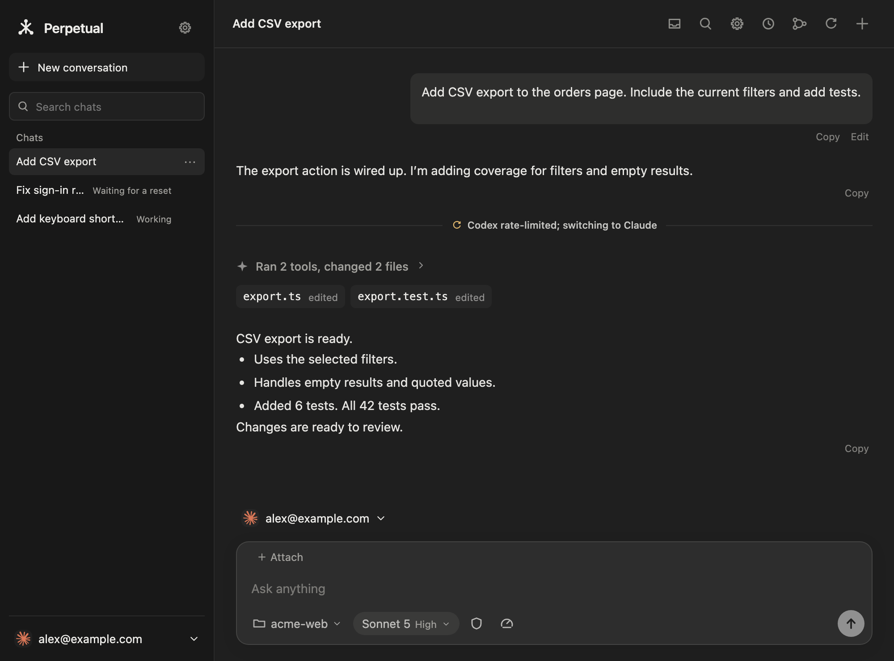
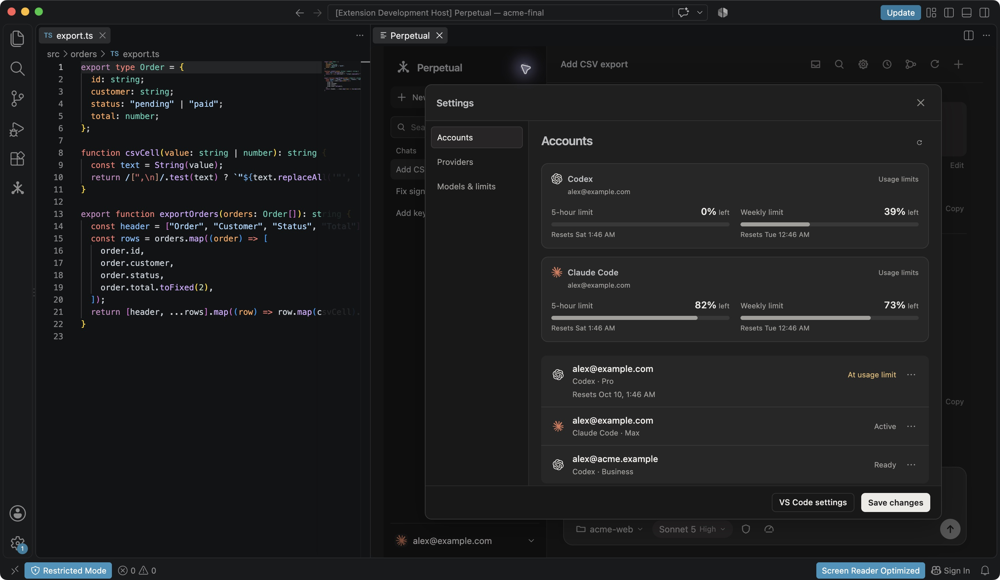

# Perpetual for VS Code

## Keep the task going when your AI hits a limit.

Perpetual brings Claude Code and Codex into one VS Code workbench. When an
account reaches its usage limit, it automatically continues the task with the
next ready account, including switching between Claude and Codex.

Your task history, project context, and code changes carry over. You can leave
a task running instead of watching the quota and moving the work by hand.

*The current interface with an example task and accounts. Codex reaches its
limit, Claude continues the work, and the result stays in the same conversation.*

## Use the accounts you already have

Connect your Claude and Codex accounts once, then put them in the order you
want Perpetual to use. It tracks each account separately and skips accounts
that are at their limit.

- **Continue on another account.** The next ready account picks up the task
  automatically.
- **Wait for a reset.** If every account is at its limit, Perpetual waits for
  the earliest known reset and resumes when access returns.
- **Return to your preferred provider.** Choose whether to switch back when
  it becomes available again.

You control automatic switching and resuming in **Settings → Models & limits**.
One signed-in provider is enough to get started. Add more accounts or both
providers to give a task more places to continue.

*Example accounts in the current settings screen. Each account has its own
sign-in, usage state, and place in the rotation.*

## One task, from the first request to the final diff

Each task keeps its conversation, files, and follow-up requests together.
The transcript shows where switches happened. When the work is ready, you can
review the changes in the same workbench.

- **Persistent conversations.** Come back to an existing task or queue another
  request while the agent is working.
- **Changes you can review.** Inspect diffs and use managed Git worktrees to
  keep agent edits separate from your checkout.
- **Permissions you choose.** Use read-only, workspace write, or full access.
  Approve actions in the workbench when a run needs your permission.
- **Separate model choices.** Save a model and reasoning level for each provider
  so a switch uses the settings you want.
- **Task budgets.** Set a token target, or a percentage of weekly usage for
  Codex, to have a task wrap up near your target and pause.

## Get started

1. Install **Perpetual for VS Code** and open a trusted workspace.
2. Install and sign into [Claude Code](https://code.claude.com/docs/en/setup),
   [Codex CLI](https://developers.openai.com/codex/cli), or both.
3. Open the Perpetual icon in the Activity Bar, or run
   **Perpetual: Open Perpetual Panel** from the Command Palette.
4. Check your accounts and switching preferences in Settings, choose your
   permissions, and give the agent a task.

Perpetual uses your existing provider access. Accounts you add have separate
credentials and session history. Codex reset credits are off by default, and
Perpetual does not enable Claude paid extra usage.

[Documentation](https://github.com/SakethSripada/Perpetual/blob/main/README.md)
· [Report an issue](https://github.com/SakethSripada/Perpetual/issues)
· [Support](https://github.com/SakethSripada/Perpetual/blob/main/SUPPORT.md)
· [Source code](https://github.com/SakethSripada/Perpetual)
