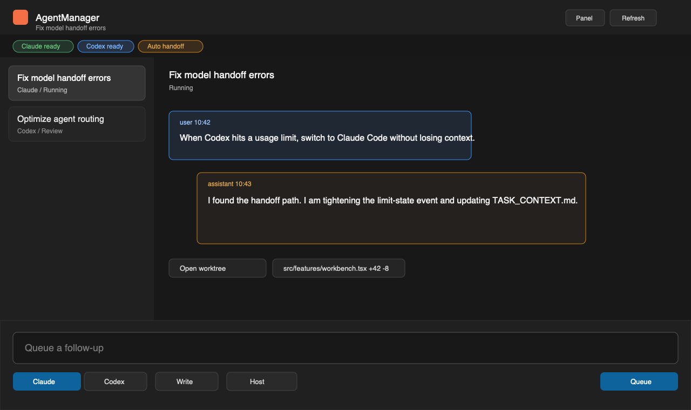

# AgentManager for VS Code

AgentManager runs Claude Code and Codex sessions from inside VS Code, preserving
context across agent switches, usage limits, and runtime changes.



## Features

- Chat-first AgentManager view in the Activity Bar, with an optional wide editor panel.
- Pick Claude Code or Codex per session, including model and reasoning controls.
- Automatic handoff when an agent hits a usage limit, using AgentManager context
  files so the next agent can continue without starting cold.
- Connect the current workspace repository or clone GitHub repositories through
  VS Code's built-in GitHub authentication.
- Queue follow-up turns while an agent is still running.
- Run Codex on Host or in Docker Sandbox through Docker's `sbx` CLI.
- Inspect session status, attached repositories, queued turns, and diffs.

## Requirements

- VS Code 1.99 or newer.
- Claude Code and/or Codex CLI installed and authenticated on the machine where
  the workspace extension runs.
- Optional Docker Sandbox support requires Docker plus the `sbx` CLI.

## Getting Started

1. Open the AgentManager icon in the Activity Bar.
2. Attach the current workspace repository, or connect a GitHub repository.
3. Pick an agent and permission mode.
4. Send a message.

AgentManager creates managed workspaces for agent edits so your original working
tree stays reviewable.

## Privacy and Security

AgentManager runs locally. Session data, transcripts, and managed workspaces are
stored under the extension's VS Code global storage directory. GitHub access uses
VS Code's built-in GitHub authentication; AgentManager does not store GitHub
OAuth tokens in its database.

The extension executes local CLIs and repository operations, so Workspace Trust
is required before running agents or attaching repositories.

## Repository layout

This is a standalone repository for the VS Code extension. Its TypeScript and
webview code live here and are edited here directly.

The bundled `am-daemon` binaries (under `bin/<target>/`) are **build artifacts**
produced by the Rust crates in the separate
[AgentManager](https://github.com/SakethSripada/AgentManager) monorepo. They are
committed here so the extension is self-contained and packageable without a Rust
toolchain.

## Daemon workflow

Edit and rebuild the extension entirely within this repo:

```bash
npm install
npm run build      # builds extension + webview into dist/
```

When daemon-side behavior changes in the monorepo and you want those changes in
the extension, sync the binary **from the monorepo** (you choose when):

```bash
# run from the AgentManager monorepo checkout
npm run sync:daemon -- --extension-repo="../AgentManagerVSCodeExtension"
# add --target=linux-x64 (etc.) for a specific platform; default = host
# add --all to build/sync every supported target
```

That rebuilds `am-daemon` and copies it into `bin/<target>/` here. Commit the
updated `bin/` and repackage. Until you run it, the extension keeps using the
daemon binary already committed — monorepo crate changes never leak in
automatically.

## Packaging

`vsce package` builds the extension first (via `vscode:prepublish`) and bundles
the daemon for the chosen target. The `check-daemon` step fails early with the
sync command if a target's binary is missing.

```bash
npm install
npm run package:darwin-arm64   # or :darwin-x64 / :linux-x64 / :linux-arm64 / :win32-x64 / :win32-arm64
```

See [PUBLISHING.md](PUBLISHING.md) for the full Marketplace checklist.
