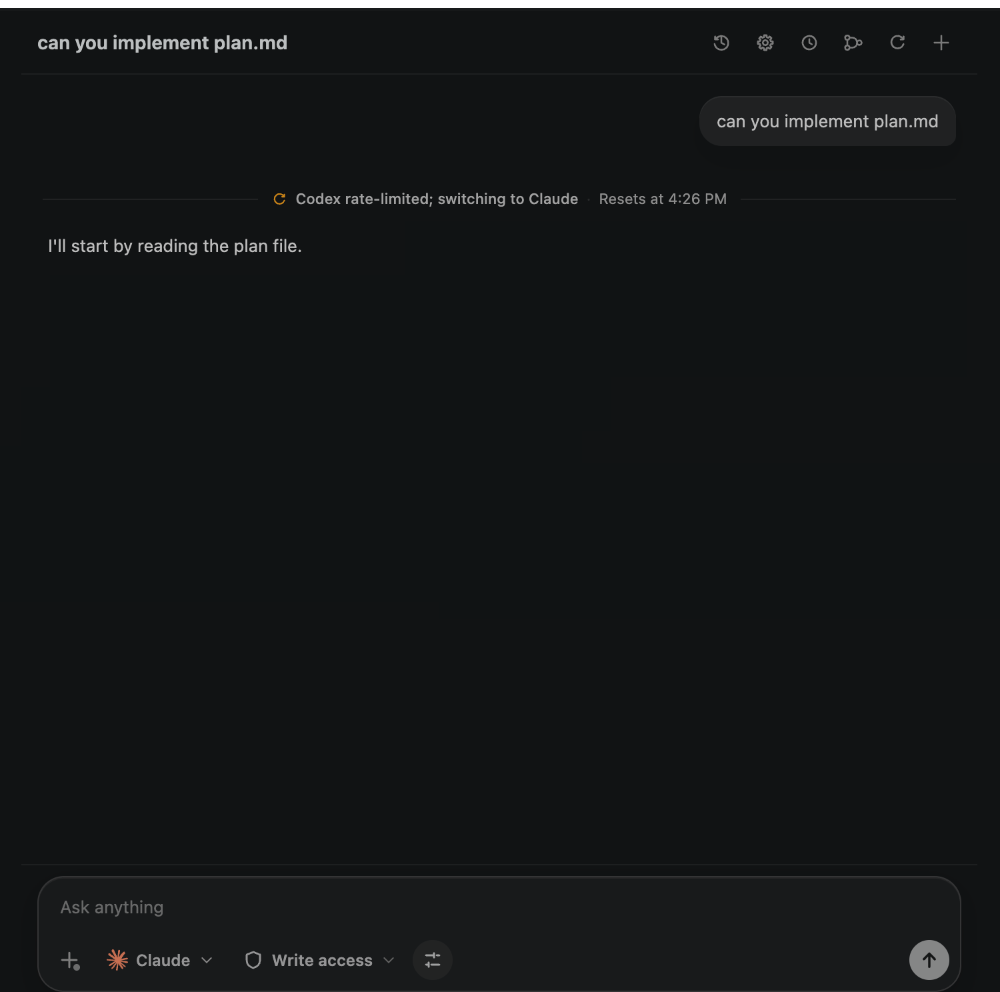

# Perpetual for VS Code

Perpetual is an open-source VS Code extension for running and coordinating
Claude Code and Codex sessions without leaving your editor. It gives each task
a persistent workbench, repository context, explicit execution controls,
reviewable changes, durable transcripts, and optional cloud continuity.



## What Perpetual provides

### One workbench for Claude Code and Codex

Perpetual puts both supported agent CLIs behind one VS Code workbench. Choose
the preferred agent for each new session, keep separate session history, and
switch between sessions without losing their transcripts or repository state.

- **Claude Code** runs through its headless CLI adapter, including its plan-style
  read-only workflow.
- **Codex** runs through its app-server adapter, including live in-workbench
  approval cards for commands, file changes, and other tool actions.
- Agent events are normalized into the same transcript so status changes,
  queued turns, rate limits, handoffs, approvals, and results remain readable.

### Persistent sessions and task history

Sessions are stored locally and can be resumed later. Each session keeps its
objective, selected agent, model settings, permission posture, repository
assignment, progress, provider session identifiers, and transcript.

You can:

- Start a new session or resume one from history.
- Send follow-up turns while work is running; Perpetual queues them and shows
  their state in the transcript.
- Stop a running session, inspect its current state, and continue it later.
- Edit a previous message and resend it as a new turn without rewriting the
  existing provider history.
- Organize longer tasks with plans, work nodes, handoffs, and durable progress
  markers.

### Repository-aware workspaces

Attach one or more repositories to a session from the local machine or through
the GitHub repository flow. When a session starts, Perpetual creates and tracks
an isolated managed worktree so agent changes do not immediately mix with the
visible checkout.

The workbench can show the session's current changes, including changed files,
diffs, branches, commits, and the relationship to the launch commit. You can
review the result and apply the managed changes back to the visible repository
when you are ready.

Repository features include:

- Current VS Code workspace detection for faster local setup.
- Local repository attachment and GitHub repository sign-in/selection.
- Multiple repository assignments for a session where supported.
- Worktree isolation and branch tracking.
- Diff loading and change review from the workbench.
- Commit and checkpoint support used by local work and cloud handoffs.

### Model, reasoning, and execution controls

The composer exposes the controls that affect future runs instead of hiding
them in provider-specific command lines.

- Select a discovered provider model or use the provider default.
- Set reasoning effort when the selected model supports it.
- Choose `Read only`, `Workspace write`, or `Autonomous` permission posture.
- Run locally on the host or, for Codex, in a Docker Sandbox.
- Configure sandbox concurrency, CPU, memory, and network policy.
- Configure Ollama or LM Studio as local Codex model targets.

The model browser reflects the models and capabilities discovered from the
active providers. If a selected model does not support the current reasoning
choice, Perpetual repairs the choice to a supported value.

### Rate-limit fallback and switchback

If an agent reaches a usage limit, Perpetual can pause the current run and
continue on another ready agent while keeping the task context. The fallback
priority and automatic behavior are configurable.

When the original provider becomes available again, Perpetual can switch back
automatically. Limit detection, fallback, switchback, retry timing, and resume
state are recorded in the transcript instead of appearing as unexplained
provider failures.

### Cloud continuity

Cloud continuity lets eligible work continue in the provider's cloud when the
local machine cannot keep running it. It is optional and must be configured for
the providers and cloud environments you use.

Perpetual can:

- Hand an active session to Claude Code on the web or Codex Cloud.
- Keep the same provider or switch providers when configured to do so.
- Ask for approval before a cloud handoff.
- Limit the number of simultaneous cloud runs.
- Carry running work over during sleep, shutdown, or another configured
  lifecycle event.
- Monitor the cloud run and reclaim its result into the local worktree.
- Resume local or cloud work when connectivity returns.

Cloud handoffs checkpoint the relevant repository state before leaving the
machine. When the result returns, the session comes back as a reviewable local
change rather than silently replacing your checkout.

### Slash commands

Type `/` in the composer to search Perpetual's built-in command picker. These
commands become structured agent actions with the appropriate permission and
review behavior:

| Command | Purpose |
| --- | --- |
| `/plan <request>` | Create a plan without making changes. |
| `/review <scope>` | Review code or changes without making changes. |
| `/security-review <scope>` | Review pending changes for security risks. |
| `/model <id>` | Set the model for future runs. |
| `/permissions <mode>` | Set read-only, write, or full-access mode. |
| `/effort <level>` | Set reasoning effort for future runs. |
| `/init <request>` | Generate provider-native repository guidance. |
| `/debug <problem>` | Diagnose and fix a concrete problem. |
| `/simplify <scope>` | Simplify changed code and verify the result. |
| `/run <request>` | Build, launch, and observe the app. |
| `/verify <request>` | Verify behavior with tests, builds, or runtime checks. |
| `/diff` | Open the current Perpetual changes view. |
| `/status` | Show the active run configuration. |
| `/new` | Start a fresh session. |
| `/resume` | Open session history. |
| `/stop` | Stop the active run. |
| `/settings` | Open Perpetual settings. |
| `/help` | List supported Perpetual commands. |

Aliases include `/code-review`, `/permission`, `/reasoning`, `/clear`,
`/reset`, `/history`, and `/config`.

## Requirements

For users:

- VS Code 1.99 or newer.
- At least one supported provider CLI, installed and authenticated:
  - [Claude Code](https://docs.anthropic.com/en/docs/claude-code/overview)
  - [Codex CLI](https://github.com/openai/codex)
- A trusted VS Code workspace for repository access and local agent execution.

Optional capabilities require their own installation and authentication:

- Docker for isolated Codex Sandbox runs.
- Ollama or LM Studio for local model execution.
- GitHub sign-in or GitHub CLI for GitHub repository workflows.
- Provider cloud access and a configured Codex Cloud environment for cloud
  continuity.

Node.js 20 or newer is required for development and packaging, but is not a
runtime requirement for users installing a published extension.

## Install

When a release is published, install Perpetual from the VS Code Marketplace or
from a release `.vsix` file:

```sh
code --install-extension ./perpetual-for-vscode-<target>-<version>.vsix
```

After installation, open the Perpetual icon in the Activity Bar or run
**Perpetual: Open Perpetual Panel** from the Command Palette. Select an agent,
choose the permission and execution settings, connect a repository if needed,
and start a session.

## Permissions and safety

Perpetual keeps its daemon local to the extension host. The bundled
`am-daemon` process owns the SQLite database, agent subprocesses, worktrees,
and local authenticated JSON-RPC socket used by the extension. It does not
expose a public network service.

Permission choices are explicit:

- **Read only** asks the provider to plan or inspect without writing.
- **Workspace write** allows normal workspace edits while retaining provider
  safeguards.
- **Ask** enables live approval for Codex app-server actions.
- **Autonomous** opts into the provider's full-automation mode.

Claude Code's headless CLI does not expose the same interactive approval
channel, so its normal and ask-style runs use the provider's non-interactive
permission mode. Codex is the adapter with live in-app approval cards.

Docker Sandbox is available for Codex sessions and applies the configured CPU,
memory, concurrency, and network policy limits. Treat Autonomous mode, local
repository write access, and cloud handoff settings as high-trust options.
Review the provider's own authentication, billing, and permission
documentation before enabling them.

## Development

Clone the repository and install the locked dependency set:

```sh
git clone https://github.com/SakethSripada/Perpetual.git
cd Perpetual
npm ci
```

Run the checks used during development:

```sh
npm test
cargo test --workspace
npm run build
```

Build and package a local extension for the current platform:

```sh
npm run build:daemon -- --target=win32-x64  # choose your target
npm run copy-daemon -- --target=win32-x64
npm run package:win32-x64
```

Or use the development helper, which builds, packages, installs, and reopens
the current workspace:

```sh
npm run install:local
```

Supported daemon targets are `darwin-arm64`, `darwin-x64`, `linux-x64`,
`linux-arm64`, `win32-x64`, and `win32-arm64`. Cross-platform builds need the
Rust target, a compatible linker, and the native C toolchain required by
dependencies such as `ring`.

The ignored live-agent test uses the real Codex CLI and may consume provider
quota:

```sh
cargo test -p am-daemon --test live_approval -- --ignored --nocapture --test-threads=1
```

## Architecture

```text
VS Code extension
        |
        | authenticated local JSON-RPC
        v
am-daemon -- am-core -- am-agents -- Claude Code / Codex
    |          |          |
    |          |          +-- provider adapters and event normalization
    |          +-- orchestration, scheduling, policy, approvals, handoffs
    +-- SQLite state, worktrees, process lifecycle, local/cloud/sandbox runtime
```

The repository is intentionally split into small Rust crates:

| Crate | Responsibility |
| --- | --- |
| `am-proto` | Shared wire and domain types. |
| `am-db` | SQLite connection, migrations, and repositories. |
| `am-vcs` | Git worktrees, diffs, commits, and repository helpers. |
| `am-agents` | Claude Code and Codex adapters plus event normalization. |
| `am-core` | Orchestration, scheduling, policy, approvals, and handoffs. |
| `am-daemon` | Headless process management and authenticated local transport. |

## Repository layout

```text
src/                 Extension host and daemon client
webview/             React workbench UI
landing/             Standalone Perpetual marketing site
crates/              Rust daemon workspace
media/               Extension icons and product preview
scripts/             Build, packaging, and daemon lifecycle helpers
```

## Configuration

Perpetual's settings are available through **Perpetual: Open Settings** or VS
Code settings search. Important groups include:

- `perpetual.defaultAgent`, `defaultModel`, and `defaultReasoning` for new
  sessions.
- `perpetual.defaultPermission` and `defaultExecutionBackend` for default
  safety and runtime behavior.
- `perpetual.defaultLocalProvider` and `defaultLocalBaseUrl` for local Codex
  model targets.
- `perpetual.autoSwitchOnLimit`, `switchBackOnRecovery`, and fallback priority
  for provider fallback behavior.
- `perpetual.cloud.*` for cloud provider strategy, approval, concurrency, and
  Codex Cloud environment configuration.
- `perpetual.local.*` for local fallback, cloud recovery, and probe timing.
- `perpetual.sandbox.*` for Docker Sandbox concurrency and resource/network
  limits.
- `perpetual.daemonPath` to use a custom daemon binary during development.

## Troubleshooting

- If the extension cannot find a daemon, run the target-specific build and copy
  commands above, or set `perpetual.daemonPath`.
- If an agent is unavailable, install its CLI and authenticate it in the same
  environment used by VS Code.
- Repository and local CLI features require a trusted workspace; Restricted Mode
  intentionally limits them.
- If Docker Sandbox is unavailable, verify Docker is running and complete the
  Codex sandbox sign-in flow shown by the workbench.
- If local models are unavailable, verify Ollama or LM Studio is running at the
  configured base URL and exposes a compatible model.
- Use the `Perpetual` output channel for daemon startup, authentication, and
  subprocess diagnostics.
- For support questions, see [SUPPORT.md](SUPPORT.md). For security reports,
  see [SECURITY.md](SECURITY.md).

## Contributing

Read [CONTRIBUTING.md](CONTRIBUTING.md) before opening a pull request. Please
include a focused description, tests for behavior changes, and any
platform-specific packaging notes.

## License

Perpetual is released under the [MIT License](LICENSE). See [NOTICE.md](NOTICE.md)
for third-party notices and [PUBLISHING.md](PUBLISHING.md) for release and
Marketplace packaging notes.
