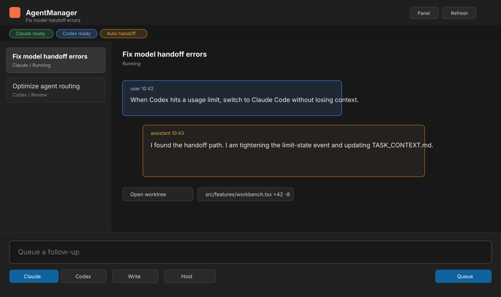

# AgentManager for VS Code

AgentManager is a local VS Code workbench for running Claude Code and Codex on
the same task. It keeps session context, repository attachments, queued turns,
approvals, and usage-limit handoffs in one place so you can move between agents
without rebuilding state.



## Features

- Chat-first AgentManager workbench in the Activity Bar, with the same view
  available as a wide VS Code panel.
- Per-session agent routing for Claude Code and Codex, including permission,
  model, reasoning, and runtime controls.
- Automatic handoff when an agent hits a usage limit, with configurable fallback
  order, recovery behavior, and retry timing.
- Local repository attachment plus GitHub repository connection through VS Code's
  built-in GitHub authentication.
- Managed workspaces for agent edits, with inline changed-file summaries and
  quick access to generated worktrees.
- Queued follow-up turns while an agent is running, including queue editing and
  reordering.
- Approval prompts for commands, tools, and file changes that need user consent.
- Codex runs on the host or inside Docker Sandbox through Docker's `sbx` CLI.

## Requirements

- VS Code 1.99 or newer.
- Claude Code and/or Codex CLI installed and authenticated on the machine where
  the workspace extension runs.
- Optional Docker Sandbox support requires Docker plus the `sbx` CLI.

## Getting Started

1. Open the AgentManager icon in the Activity Bar.
2. Attach the current workspace repository, add a local folder, or connect a
   GitHub repository.
3. Pick Claude or Codex, then choose the permission mode and optional run
   settings.
4. Send a message. If a run is already active, the message is queued as the next
   turn.

AgentManager creates managed workspaces for agent edits so your original working
tree stays reviewable.

Use **AgentManager: Open AgentManager Panel** from the Command Palette when you
want the workbench in VS Code's bottom panel instead of the side bar.

## Configuration

The extension contributes `agentmanager.*` settings for defaults and runtime
policy:

- `defaultAgent`, `defaultPermission`, `defaultExecutionBackend`,
  `defaultModel`, and `defaultReasoning` control new sessions.
- `autoSwitchOnLimit`, `switchBackOnRecovery`, `fallbackPriority`,
  `resumeWithEarliestAgent`, and `unknownLimitRetrySeconds` control handoff
  behavior.
- `sandbox.maxConcurrent`, `sandbox.cpus`, `sandbox.memory`, and
  `sandbox.networkPreset` control Docker Sandbox runs.
- `daemonPath` can point at a custom `am-daemon` binary. Empty uses the binary
  bundled with the extension.

## Privacy and Security

AgentManager runs locally. Session data, transcripts, and managed workspaces are
stored under the extension's VS Code global storage directory. GitHub access uses
VS Code's built-in GitHub authentication; AgentManager does not store GitHub
OAuth tokens in its database.

The extension executes local CLIs and repository operations, so Workspace Trust
is required before running agents or attaching repositories.

## Repository layout

This is a standalone repository for the VS Code extension. Its TypeScript and
webview code live here and are edited here directly.

The bundled `am-daemon` binaries (under `bin/<target>/`) are **build artifacts**
produced by the Rust crates in the separate AgentManager monorepo. They are
committed here so the extension is self-contained and packageable without a Rust
toolchain.

## Development

```bash
npm install
npm run build
npm test
```

For iterative work, run `npm run watch:extension` and `npm run watch:webview` in
separate terminals.

## Daemon workflow

When daemon-side behavior changes in the monorepo and you want those changes in
the extension, sync the binary **from the monorepo** (you choose when):

```bash
# run from the AgentManager monorepo checkout
npm run sync:daemon -- --extension-repo="../AgentManagerVSCodeExtension"
# add --target=linux-x64 (etc.) for a specific platform; default = host
# add --all to build/sync every supported target
```

That rebuilds `am-daemon` and copies it into `bin/<target>/` here. Commit the
updated `bin/` and repackage. Until you run it, the extension keeps using the
daemon binary already committed — monorepo crate changes never leak in
automatically.

## Packaging

`vsce package` builds the extension first (via `vscode:prepublish`) and bundles
the daemon for the chosen target. The `check-daemon` step fails early with the
sync command if a target's binary is missing.

```bash
npm install
npm run package:darwin-arm64   # or :darwin-x64 / :linux-x64 / :linux-arm64 / :win32-x64 / :win32-arm64
```

See [PUBLISHING.md](PUBLISHING.md) for the full Marketplace checklist.
